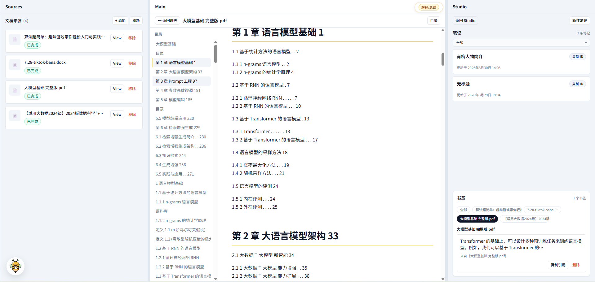
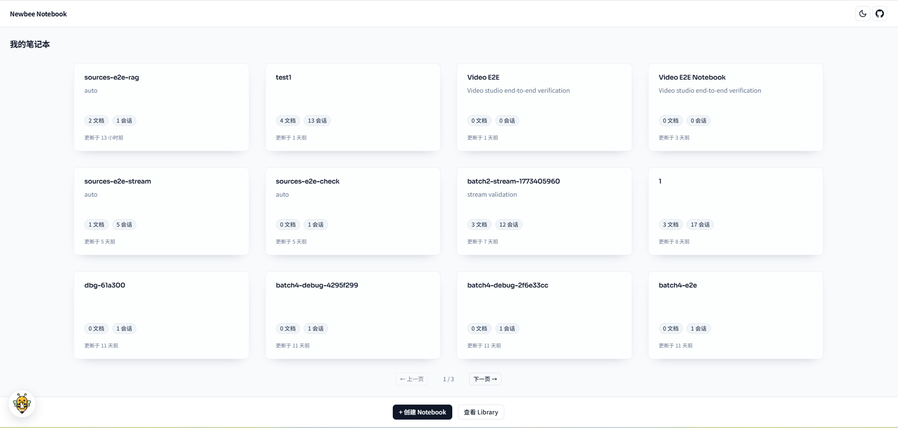
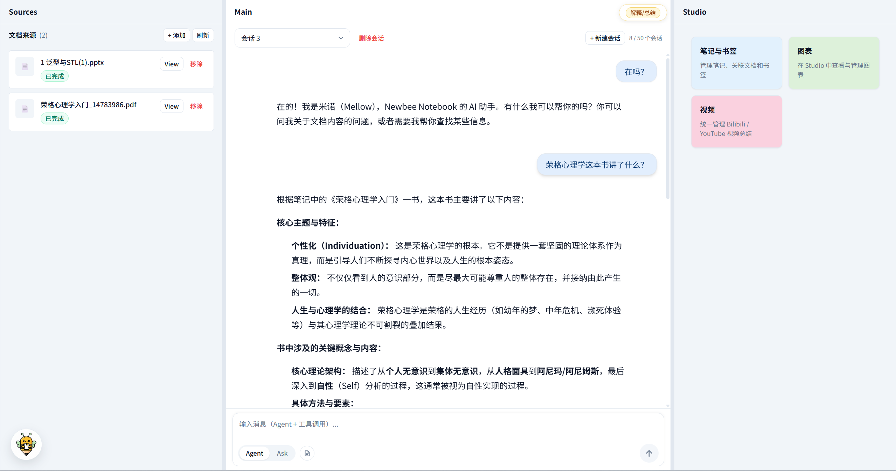
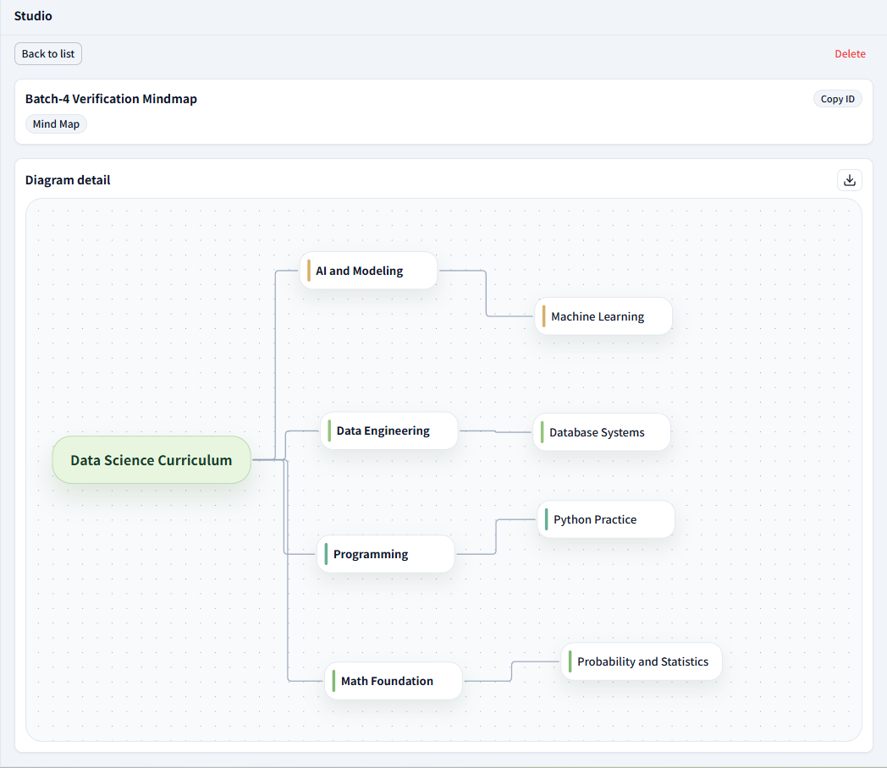
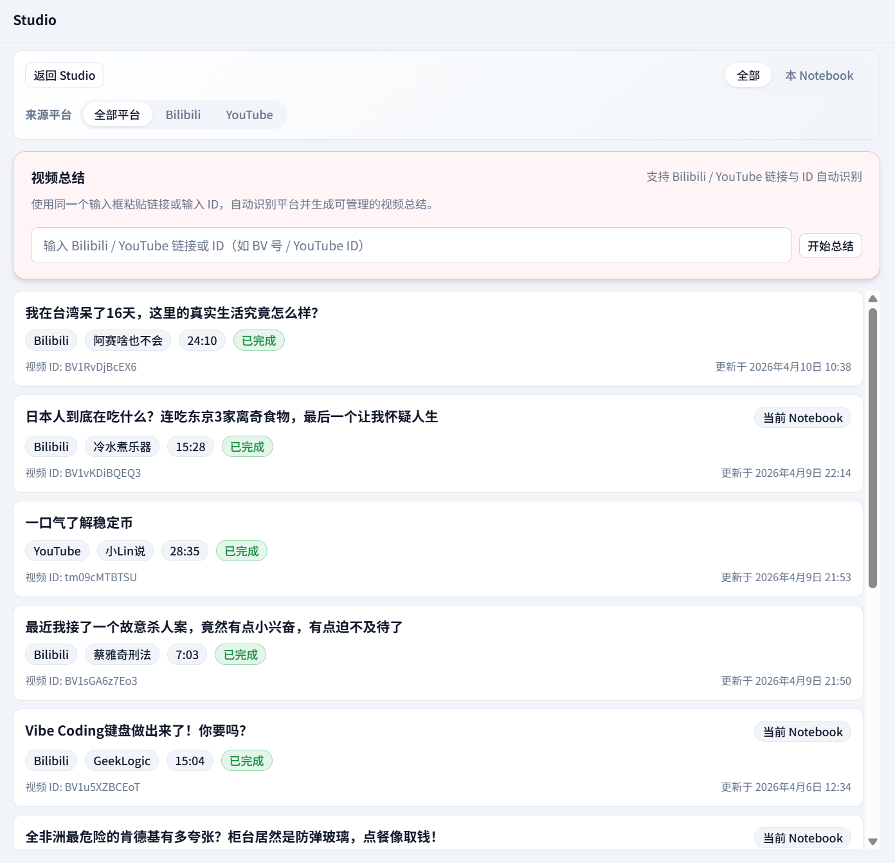

<div align="center">


# 🐝Newbee Notebook

**新蜂阅读器**

AI 驱动的交互式文档阅读器。高精度内容解析与检索、Agent 笔记与图表、Bilibili 视频总结——自托管，数据完全由你掌控。

Read, search, and interact with your documents through AI agents — self-hosted, private, extensible.

[快速启动](#快速启动) · [详细配置](quickstart.md) · [功能介绍](#核心特性) · [English](README_en.md)

[](LICENSE.md)
[](https://github.com/diverHansun/newbee-notebook/stargazers)
[](https://github.com/diverHansun/newbee-notebook/issues)

</div>

---

## 产品预览

<div align="center">
  <a href="https://github.com/user-attachments/assets/ec24276f-4adf-4986-98fc-8fadb01867f5">
    
  </a>
  <p><em>video</em></p>
  <p><a href="https://github.com/user-attachments/assets/250fcf42-a863-4a92-8e30-2693cd2da6e3">观看演示视频</a></p>
</div>

<div align="center">
  
  <p><em>笔记本仪表盘 — 创建和管理你的知识空间</em></p>
</div>

<div align="center">
  
  <p><em>交互式文档阅读 — 左侧文档源、中间 Markdown 渲染、右侧 Studio 面板</em></p>
</div>

<details>
<summary>更多截图</summary>
<br>

<div align="center">
  
  <p><em>AI Agent 对话 — 基于文档内容的智能问答与引用溯源</em></p>
</div>

<div align="center">
  
  <p><em>Agent 图表生成 — /diagram 自动创建知识图谱与思维导图</em></p>
</div>

<div align="center">
  
  <p><em>Bilibili 视频总结 — 视频转录与结构化摘要</em></p>
</div>

</details>

---

## 核心特性

**交互式文档阅读** — 不仅是看文档，还是和文档对话。选中任意段落即可触发总结（Conclude）或讲解（Explain），阅读过程中遇到的疑问当场解决。书签系统帮你标记和回顾重要内容，不再丢失灵感。

**高精度文档解析与检索** — 基于 [MinerU](https://github.com/opendatalab/MinerU) 的高保真 PDF 解析，表格、公式、多栏排版都能准确还原为 Markdown，数百页的大文件也能从容处理。向量与全文混合检索（pgvector + Elasticsearch）双管齐下，引用溯源精确到原文段落，找到的就是你要的。

**Agent 笔记、图表与视频** — 输入 `/note` 让 Agent 帮你整理笔记，`/diagram` 自动生成思维导图和知识图谱。支持 Bilibili / YouTube 视频转录与智能总结，从视频内容中快速提炼关键信息。Chat 支持图像生成，AI 绘图结果直接内联展示在对话中。笔记与视频摘要支持一键导出为 Markdown，整理好的内容随时带走。Agent 不是噱头，是真正帮你从文档里提炼结构化知识的工具。

**可配置的 MCP 工具链** — 通过 MCP（Model Context Protocol）和 Skills 系统，你可以自由扩展 Agent 的能力边界。需要接入什么外部工具和服务，自己动手配就行。

**自托管，数据隐私优先** — 完全本地部署，不依赖任何第三方云服务存储你的数据。文档和对话全部留在你自己的服务器上，没有数据上报，没有使用追踪。开源免费（AGPL-3.0），你只需要准备好自己的 API Key。

---

## 横向对比

| 特性 | Google NotebookLM | Open Notebook | Newbee Notebook |
|---|:---:|:---:|:---:|
| 开源 | - | MIT | AGPL-3.0 |
| 自托管 | - | ✓ | ✓ |
| 数据隐私 | 云端存储 | 本地 | 本地 |
| 文档解析 | 黑盒 | 基础解析 | MinerU 高精度解析 |
| 交互式阅读（Conclude / Explain） | 有限 | - | ✓ 选中即触发 |
| 书签系统 | - | - | ✓ |
| Agent 笔记 / 图表 | - | Transformations | /note · /diagram |
| 视频总结 | YouTube | - | Bilibili + YouTube |
| 检索方式 | 黑盒 | 向量检索 | 混合检索 + 引用溯源 |
| 大文件支持 | 有限 | 有限 | MinerU 分块，支持数百页 |
| LLM 选择 | 仅 Gemini | 多模型 | 可配置（智谱 / 通义等） |
| 扩展机制 | 封闭 | 插件 | MCP + Skills |

---

## 快速启动

三步开始使用。更多进阶配置（GPU 模式、MinIO 存储、本地 Embedding 等）请查看 [quickstart.md](quickstart.md)。

### 1. 配置环境变量

Windows PowerShell：

```powershell
Copy-Item .env.example .env
```

macOS / Linux / Git Bash：

```bash
cp .env.example .env
```

编辑 `.env`，填入必要的 API Key：

```bash
# LLM 服务（建议都填写）
# 智谱 AI — 获取地址：https://open.bigmodel.cn/
ZHIPU_API_KEY=your_key_here

# 通义千问 — 获取地址：https://bailian.console.aliyun.com/
DASHSCOPE_API_KEY=your_key_here

# 如需在前端设置面板 / API 中切换 LLM、Embedding、MinerU
FEATURE_MODEL_SWITCH=true

# 数据库密码
POSTGRES_PASSWORD=your_password

# PDF 解析（默认 Docker 模式使用云端 MinerU）
# MinerU API Key — 获取地址：https://mineru.net/apiManage/token
MINERU_MODE=cloud
MINERU_API_KEY=your_mineru_key
```

### 2. 选择启动模式

根据你的硬件选择合适的模式：

> 没有独立显卡也可以直接使用，选择“默认 Docker 模式”即可。
> 这里的“纯 CPU 全本地”特指 MinerU 和 Embedding 都在本机 CPU 上运行，不等于默认 Docker 模式。

| 常见设备 | 推荐模式 | 命令 |
|---|---|---|
| Windows / macOS / Linux 普通笔记本或台式机（无独显、仅集显） | **默认 Docker 模式** | `docker compose up -d` |
| Apple Silicon Mac / Intel Mac | **默认 Docker 模式** | `docker compose up -d` |
| AMD / Intel GPU 设备 | **默认 Docker 模式** | `docker compose up -d` |
| NVIDIA GPU，显存 ≥ 8GB，内存 ≥ 32GB | **GPU 本地增强模式** | `docker compose -f docker-compose.yml -f docker-compose.gpu.yml up -d --build` |

| 模式 | 硬件要求 | 命令 |
|---|---|---|
| **默认 Docker 模式**（推荐） | 无特殊要求 | `docker compose up -d` |
| **GPU 本地增强模式** | NVIDIA GPU，显存 ≥ 8GB，内存 ≥ 32GB | `docker compose -f docker-compose.yml -f docker-compose.gpu.yml up -d --build` |
| **纯 CPU 全本地**（不推荐） | 无独立显卡，内存 ≥ 32GB | 当前不提供官方一键 Compose，需自行扩展 |

**默认 Docker 模式**（最简单，开箱即用）：

```bash
docker compose up -d
```

首次启动会自动构建前端、API、Celery Worker 镜像，并在构建阶段安装 Python 依赖，请耐心等待。默认 Docker 模式会给 API / Worker 安装 CPU 版 torch，这样后续重启 `celery-worker` 时不会再重复执行 `pip install`。这个模式下默认使用 `MinIO + 云端 MinerU + API Embedding`，不会启动本地 `mineru-api` 容器。

这个模式适合大多数设备，包括 Windows / macOS / Linux 的无 GPU 机器、只有集显的机器、Apple Silicon，以及当前没有官方 GPU 覆盖配置的 AMD / Intel GPU 设备。

如果你需要调整默认 Docker 模式里的 CPU 版 torch 版本，可在 `.env` 中设置 `PYTHON_RUNTIME_TORCH_VERSION`，然后重新执行 `docker compose up -d --build`。

如果你有 NVIDIA GPU（显存 ≥ 8GB，系统内存 ≥ 32GB），可以切换到 GPU 本地增强模式，让 MinerU 和 Embedding 都在本地 GPU 上运行。使用前需要先下载 Embedding 模型，详见 [quickstart.md — 本地 GPU 模式](quickstart.md#模式二gpu-本地增强模式nvidia-显存--8gb系统内存--32gb)。

如果你使用的是 Apple Silicon、AMD GPU 或 Intel GPU，目前仓库没有提供对应的 Metal / ROCm / oneAPI 本地加速覆盖配置，建议继续使用默认 Docker 模式。

如果你使用的是 NVIDIA GPU，不建议单独改 `torch==x.y.z`；应在 `.env` 中设置 `CELERY_WORKER_BASE_IMAGE` 为与你驱动匹配的 `pytorch/pytorch` 镜像 tag，再执行 GPU 模式的 `--build` 启动命令。

### 3. 开始使用

| 服务 | 地址 |
|---|---|
| 前端界面 | http://localhost:3000 |
| API 文档（Swagger） | http://localhost:8000/docs |

> 遇到问题？查看 [quickstart.md](quickstart.md) 中的常见问题部分。

---

## 文档

| 文档 | 说明 |
|---|---|
| [quickstart.md](quickstart.md) | 完整的安装配置指南，包括 GPU 模式、MinIO 存储等进阶选项 |
| [API 文档](http://localhost:8000/docs) | Swagger UI，启动服务后可访问 |
| [docs/](docs/) | 架构设计与技术文档 |

---

## 近期计划

- [ ] skill机制扩展
- [ ] 新增echarts图表功能
- [ ] studio模块新增功能

有想法？欢迎通过 [Issues](https://github.com/diverHansun/newbee-notebook/issues) 告诉我。

---

## 致谢

本项目的pdf文档解析能力由 [MinerU](https://github.com/opendatalab/MinerU) 提供支持，感谢 [OpenDataLab](https://github.com/opendatalab) 团队的出色工作。

## 贡献

欢迎提交 Issue 和 Pull Request。

## License

[AGPL-3.0](LICENSE.md)

---

